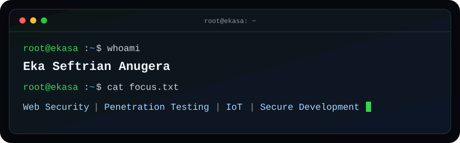

<div align="center">
  

  <br />

  <a href="https://ekasa.my.id"></a>
  <a href="https://linkedin.com/in/ekasa"></a>
  <a href="mailto:ekaseftrian@protonmail.com"></a>
</div>

## About me

```console
root@ekasa:~$ cat about.txt
Cybersecurity enthusiast from Indonesia with a focus on web application
security, penetration testing, vulnerability research, and secure development.

I learn by building real systems, solving CTF challenges, studying attack
surfaces, and turning technical findings into clear, actionable reports.
```

My work sits at the intersection of **cybersecurity, web engineering, IoT, and applied machine learning**. I enjoy understanding how systems behave end to end-from embedded devices and APIs to dashboards and security controls.

## Current focus

- Strengthening practical web application security and penetration-testing skills.
- Building low-impact tools for authorized security assessment.
- Exploring vulnerability research through CTF and bug-bounty practice.
- Designing secure, maintainable web and IoT systems.


## Technical toolkit

| Area | Technologies and practices |
| --- | --- |
| **Security** | Web application security, penetration-testing fundamentals, vulnerability research, CTF, Bug Bounty, security reporting |
| **Backend & data** | PHP, MySQL, REST-style APIs, application hardening |
| **Frontend** | React, Next.js, TypeScript, JavaScript, HTML, CSS, Tailwind CSS |
| **Scripting & research** | Python, machine-learning workflows, dataset preprocessing and evaluation |
| **IoT** | ESP8266, ESP32, Arduino, device-to-server integration |


## Let’s connect

I am open to conversations about web security, penetration testing, IoT systems, and secure application development. If you are working on something interesting or simply want to exchange ideas, feel free to reach out through [LinkedIn](https://linkedin.com/in/ekasa) or [email](mailto:ekaseftrian@protonmail.com).

<div align="center">
  <sub>Keep learning and stay alive</sub>
</div>
